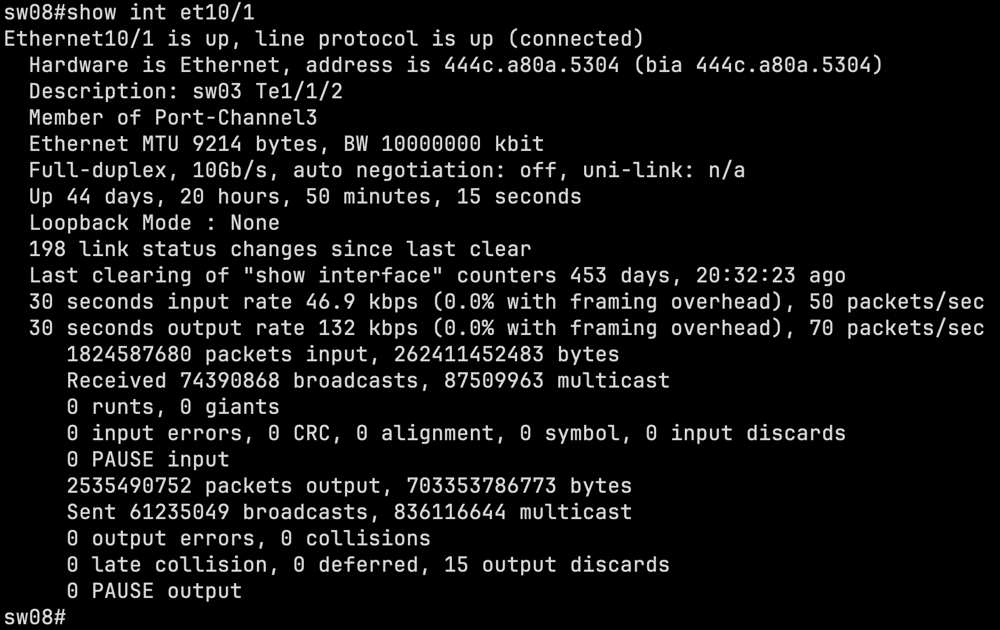
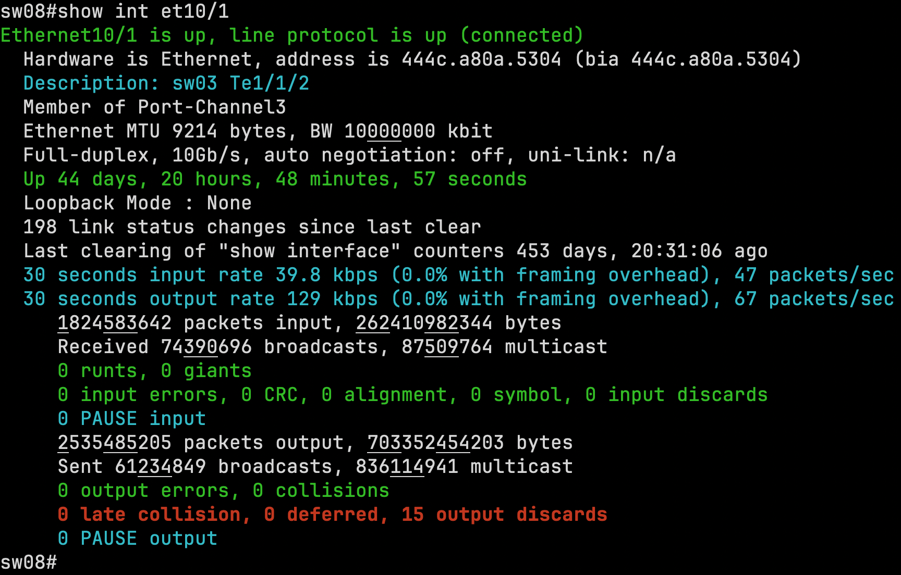
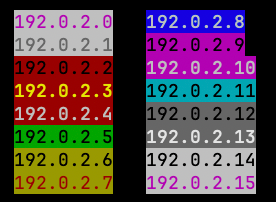

# router-colorizer

Colorize router and switch CLI output.

Reading `show interfaces` on a busy device means finding the handful of
important lines in a screen of text. This filter sits at the end of a pipe and
marks them: green for good, orange for neither good nor bad, red for errors,
cyan for merely notable. Most lines are left alone, which is what makes the
colored ones easy to find.

```sh
ssh router.example.com | router-colorizer
```

It also colors every IP address by hashing it, and underlines alternating
groups of three digits in long numbers. Anything it does not recognize passes
through untouched, so it is safe to leave in a pipeline permanently.

The same `show interface` output, without and with the colorizer:





The red line shows an interface with discards, which in the plain version looks
similar to every zero around it. Cyan is used for informational lines, while
yellow is used for potentially concerning values. You can also notice the
underlines, which makes the "BW 10000000" value much more readable.

This is a Go port of [App::RouterColorizer][perl], which has now
replaced the Perl version. The port was made utilizing a LLM for machine
translation between languages.

[perl]: https://github.com/jmaslak/App-RouterColorizer

## Install

For Linux (amd64, arm64, or riscv64), macOS (amd64 or arm64), or FreeBSD
(amd64 or arm64), install a prebuilt release binary with:

```sh
curl -fsSL https://raw.githubusercontent.com/jmaslak/go-router-colorizer/main/install.sh | sh
```

This installs to `/usr/local/bin`, falling back to `~/.local/bin` if that is
not writable. Once installed, `router-colorizer -selfupdate` fetches and
installs any later release in place.

Windows (amd64 or arm64) builds are also published on the
[releases page][releases], but `install.sh` is a POSIX shell script and does
not run there; download the `.exe` directly, or use `-selfupdate` once it is
in place.

With a Go toolchain instead:

```sh
go install github.com/jmaslak/go-router-colorizer/cmd/router-colorizer@latest
```

Or build from a checkout:

```sh
go build ./cmd/router-colorizer
```

The program has no dependencies outside the standard library.

## Use

`router-colorizer` reads standard input and writes standard output. It takes no
arguments:

```sh
ssh router.example.com | router-colorizer
grep -h . captured-output.txt | router-colorizer
```

Interactive sessions work too. A prompt is a line that is never finished, so a
partial line that has gone quiet for 10ms is written out rather than held back;
`-flush-delay` changes that interval if a slow link makes it too eager.

A shell function makes it convenient. In `~/.bashrc` or `~/.zshrc`:

```sh
sshr() {
    router-colorizer --cmd ssh -- "$@"
}
```

Then `sshr router.example.com`.

`-cmd` does the same thing without a pipeline: it runs the given command,
forwarding any arguments `router-colorizer` does not recognize, and colorizes
its standard output and standard error as they arrive. Standard input passes
through to the command, and the command's exit code becomes
`router-colorizer`'s.

```sh
router-colorizer -cmd ssh -- router.example.com
```

### What gets colorized

The colors assume a terminal with a **dark background**.

| Color  | Meaning                                                                |
| ------ | ---------------------------------------------------------------------- |
| green  | A good value: an interface that is up, a BGP session established, error counters at zero. |
| orange | Neither good nor bad: an administratively disabled interface, an acknowledged alarm. |
| red    | An error: an interface down unexpectedly, nonzero error counters, a failed authentication. |
| cyan   | Notable but not a verdict: descriptions, rates, route maps, LLDP neighbors. |

**IP addresses** get a colored background chosen by hashing the address and its
prefix length. A given address always looks the same, so a transposition or a
copy of the wrong address shows up as a change in color: if `1.2.3.4` is
usually white on blue and one instance is black on red, it is not the same
address. Both IPv4 and IPv6 are recognized, with or without a prefix length.



**Long numbers** get alternating groups of three digits underlined, so that
1000000 can be told from 10000000 without counting. This helps anyone who finds
long digit strings hard to read, which includes a lot of people staring at
counters at 2am.

### Supported devices

The rules were written against, and are tested against, captured output from:

- Arista EOS
- Cisco IOS
- Juniper Junos
- VyOS / FRR
- Ciena WDM and packet-optical devices

Other devices often work, because vendors imitate each other's CLIs, but they
are not what the rules were developed against. Output that is not recognized is
passed through unchanged, never garbled.

## As a library

```go
package main

import (
	"fmt"
	"os"

	"github.com/jmaslak/go-router-colorizer/colorizer"
)

func main() {
	// A string at a time.
	fmt.Print(colorizer.FormatText("Ethernet1 is up, line protocol is up\n"))

	// Or a stream, colorized as it arrives.
	if err := colorizer.Filter(os.Stdout, os.Stdin, colorizer.DefaultFlushDelay); err != nil {
		fmt.Fprintln(os.Stderr, err)
		os.Exit(1)
	}
}
```

`FormatText` takes any fragment of a stream: it colorizes whole lines and
handles a trailing partial line as far as it goes. It is safe for concurrent
use. Full documentation is on [pkg.go.dev][godoc].

For a large captured file there is `FormatTextParallel(text, workers)`, which
returns exactly what `FormatText` returns while dividing the text at line
endings across goroutines — zero workers means one per CPU. `Filter` calls it
automatically, so a redirected file uses every core while a live session, whose
blocks are far too small to divide, stays on one goroutine and keeps its
latency.

[godoc]: https://pkg.go.dev/github.com/jmaslak/go-router-colorizer/colorizer

## Why

This tool was conceived to solve some neurodiversity-related challenges
the author has on her job. Network device CLIs typically output a wall
of text, and may present numbers such as 10000000 with no chunking,
making them hard to parse quickly. With her neurodivergence, and
tendency to see the trees rather than the focus (thus skimming can be
difficult), a means of pulling out important information from the less
(usually) important information is helpful and can speed processing.

The author's neurodivergence also makes it difficult to parse some of this
output, and makes her prone to typos. The typos, in particular, can have
significant impact, particularly at 2:00 AM while on-call!  For this,
she drew from synesthesia, a neurodivergence combination of senses that
is popularly known as, for instance, causing certain number to be
strongly associated mentally with certain colors. The author is not a
synesthete, but benefits from the artificial synesthesia this program
applies, by colorizing different kinds of important information, making
numbers easier to read, and associating IP addresses with different
colors, she can work on network devices with a higher level of accuracy.

## How it works

Every line is run past a list of rules, in order. A rule is a regular
expression plus a note of which of its submatches to color:

```go
whole(`^(  BGP state is Established[^\n]*)$`, green),
whole(`^(  BGP state is [^\n]*)$`, red),
```

Order carries meaning. Colorizing a line puts an escape sequence at the front
of it, which stops later rules anchored at the start of the line from matching —
so the specific rule goes first and the general rule below it only sees lines
the specific one did not claim. An established session is green; every other
state is red. Rules that color separate columns of the same line do stack,
because each one only rewrites the columns it captured.

The interesting files:

| File            | Contents                                                     |
| --------------- | ------------------------------------------------------------ |
| `colorizer.go`  | Splitting a stream into lines, and the order things run in.  |
| `rules.go`      | The rule type and how a rule rewrites a line.                |
| `patterns.go`   | Regular expression fragments shared between rules.           |
| `arista.go`     | Arista EOS and Cisco IOS rules, and interface counter lines. |
| `junos.go`      | Juniper Junos and VyOS rules.                                |
| `ciena.go`      | Ciena rules, which are mostly tabular.                       |
| `ip.go`         | Finding and coloring addresses.                              |
| `numbers.go`    | Underlining digit groups.                                    |
| `stream.go`     | `Filter`, including when to give up on a partial line.        |
| `parallel.go`   | Dividing a large text at line endings across goroutines.     |

To teach it a new line, add a rule to the table for that vendor, and add the
line and its expected colorization to the matching pair of files in
`colorizer/testdata`.

## Development

```sh
go test ./...                                   # golden files and unit tests
go test -race ./...
go test -fuzz FuzzFormatText ./colorizer        # property fuzzing
go vet ./...
go test -bench . ./colorizer
```

The bulk of the test suite is golden files under `colorizer/testdata`: captured
device output paired with its expected colorization, one line per test case, so
a failure names the line that changed.

## Throughput

Colorizing is about 4.5 MB/s per core on a 2025 Macbook Pro. That is far more
than most sessions produce, so throughput only matters when piping a large
capture, and for that the work is divided across cores. On a 16-core
Macbook, 820 KB of captured Arista output:

| | Time | Throughput |
| --- | --- | --- |
| App::RouterColorizer (Perl) | 1.03 s | 0.8 MB/s |
| this, one core | 0.19 s | 4.3 MB/s |
| this, all cores | 0.048 s | 17 MB/s |

All three produce identical bytes. The division happens per block of input, so
it never changes what a live session feels like.

Per line, the time goes almost entirely into matching the rule patterns — about
half of it inside `regexp` — so the remaining lever is testing each line against
fewer of the 141 patterns, not allocating less. Colorizing a screenful of output
allocates about 5,000 objects and 575 KB.

## Bugs

Bug reports are welcome as [GitHub issues][issues], or by email to
<jmaslak@antelope.net>.

If you believe a bug has security implications, please report it privately by
email to <jmaslak@antelope.net> before disclosing it publicly, so there is a
chance to fix it first.

[issues]: https://github.com/jmaslak/go-router-colorizer/issues
[releases]: https://github.com/jmaslak/go-router-colorizer/releases

## Author

Joelle Maslak <jmaslak@antelope.net>

## License

Copyright (C) 2021-2026 Joelle Maslak.

Licensed under the Artistic License 2.0. See [LICENSE](LICENSE).
